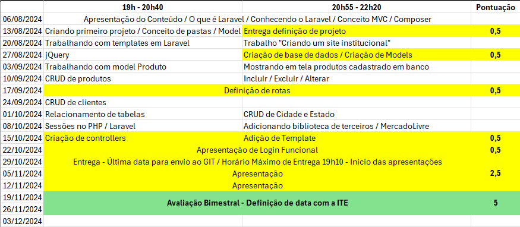

# Linguagem de Programação Web II

Continuidade do conteúdo Linguagem de Programação Web I (PHP), nesta disciplina iremos trabalhar com o PHP utilizando o framework [Laravel](https://laravel.com/)

A disciplina será dividida em módulos, iremos trabalhar com pequenos blocos em Laravel e ao final da disciplina você será capaz de trabalhar com Laravel visando o mercado de trabalho.

## Nota final
- A nota final será de no máximo 10 pontos
- Estes pontos serão divididos em:

### 1. Avaliação ao final do Semestre
- Nota máxima 5,00 pontos
- Data da avaliação a ser definida
- Quem define a data da avaliação é a ITE e será postada no calendário da ITE
- Avaliação escrita
  - Poderá ser utilizado os computadores da ITE para a avaliação.
  - Não haverá acesso a internet
  - Não será possível o uso de cosulta
  - É extremamente proibido o uso de celulares ou componentes eletrônicos pessoais
  - A prova deverá ser transcrita a tinta para folha de prova

### 2. Avaliação durante o Semestre
- Nota máxima 5,00 pontos
- A avaliação será feita na forma de trabalho
- INDIVIDUAL
- A nota será dividida em
  - 2,5 referente as entregas (datas estão na imagem a seguir)
    - 0,5 ponto por entrega e correção no mesmo dia
  - 2,5 referente a apresentação (datas estão na imagem a seguir)
    - É obrigatória a presença de todos os alunos durante a apresentação, inclusive os que já tenham apresentado o trabalho
  - Caso o aluno falte no dia da apresentação, os pontos referentes a data serão perdidos
    - Salvo o aluno apresente um atestado conforme previsto no Regimento Educacional fornecido pela ITE.

## Datas das aulas
- Haverá aula todos os dias letivos existentes no calendário, salvo exista alguma orientação contrária informada pela ITE ou pelo coordenador.

## Contato com o Professor
- Todo o contato com o professor deverá ser feito através de e-mail [rodrigo.noescobar@gmail.com](mailto:rodrigo.noescobar@gmail.com)
- Não responderei mais perguntas via WhatsApp

## Lista de presença
- Serão feitas duas chamadas, sendo:
    - Primeira entre 19h10 e 20h20, referente a primeira e segunda aula
    - Segunda entre 21h e 22h, referente a terceira e quarta aula
- Dúvidas sobre presença, verificar Regimento Educacional
- Atestados NÃO são dados ao professor e sim a secretaria da ITE

## Avaliação Substitutiva
- Todo o conteúdo será cobrado

## Exame
- TODO o conteúdo será cobrado

## Dúvidas?
- Leia novamente este documento

# Documentação do Trabalho

#### Entregas e Correção
- Todas as entregas deverão ser feitas através de um repositório GIT criado pelo aluno
- A correção será feita em horário de aula entre aluno e professor

#### Entrega Final
- A entrega final deverá ser feita no **dia 01/11/2024**
- **HORÁRIO MÁXIMO** de entrega **19h20**
- Deverá ser enviado e-mail com o **assunto** *Avaliação LPWEBII - Tuma B - Projeto Cafeteria (nome do seu projeto)*
- Entrega fora do horário ou a não entrega, resultará na nota final sendo a soma das entregas feitas até o dia 01/11/2024 às 18h59.

## Calendário

## Outros materiais
[Drive](https://drive.google.com/drive/folders/1UGSLJfwW-U2OIks-HUKDeGNACRsldsyA?usp=sharing)